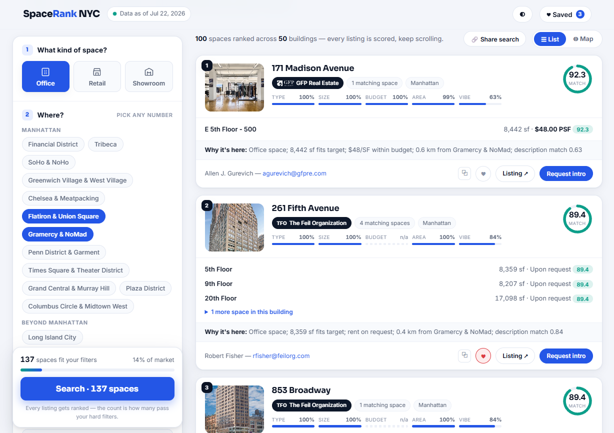
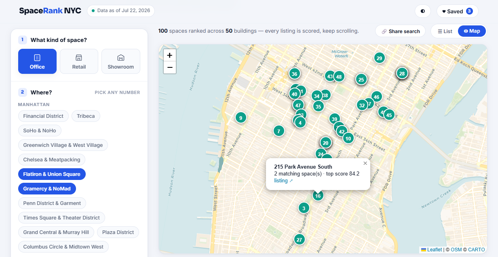
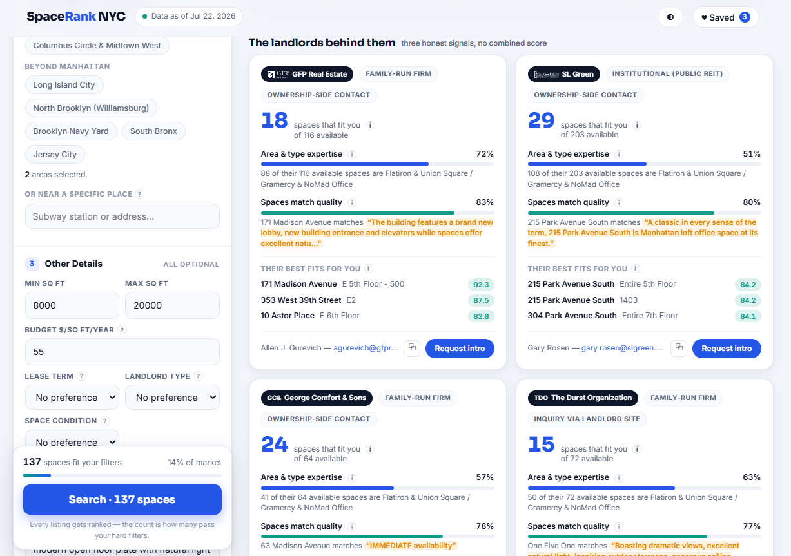
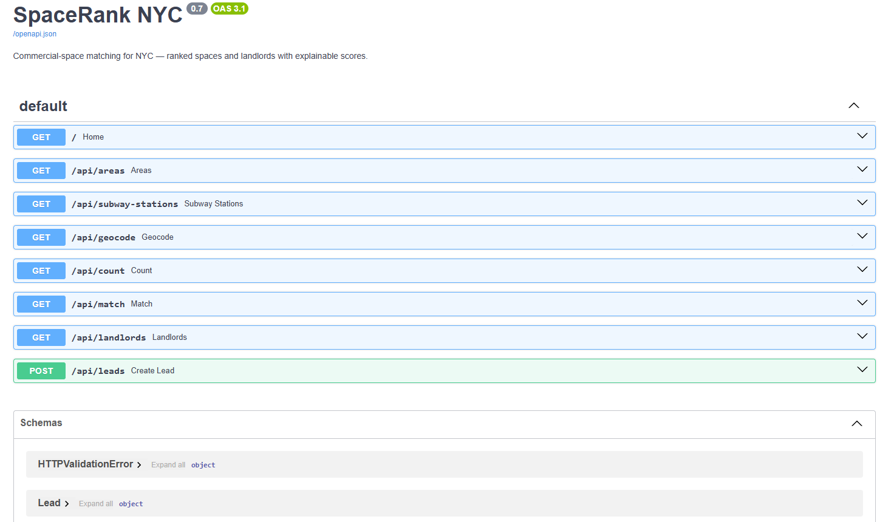

# SpaceRank NYC

**A commercial real-estate matching engine for New York City — live at [spacerank-nyc.vercel.app](https://spacerank-nyc.vercel.app)**

[](test_engine.py)
[](requirements.txt)
[](LICENSE)
[](.github/workflows/refresh_data.yml)

A tenant describes what they need — space type, size, budget, neighborhood,
a sentence in plain English — and SpaceRank ranks every available office
space in the dataset (0–100, five explained signals) and the landlords
behind them (three transparent signals), with a direct ownership-side
leasing contact for each result. No brokers, no invented numbers, no
black-box score.

Built solo, end to end: 17 landlord scrapers, a data-cleaning + enrichment
pipeline, a from-scratch matching engine, a semantic-search layer with a
three-tier fallback chain, a closed-form rent-estimation model, a FastAPI
backend, a single-file no-framework frontend, and a weekly GitHub Actions
pipeline that keeps the whole thing self-updating in production.

**Current dataset: 1,123 rows · 1,013 available spaces · 270 buildings · 17 landlords · 100% geocoded**

<p align="center">
  
</p>

<p align="center">
  
  
</p>

---

## Why this project exists

Every real listing platform either hides its scoring, buries you in broker
noise, or both. This one is the opposite bet: **every number is real and
every score is explainable.** If a value is unknown, it shows as "—" and
scores neutral — never a guess dressed up as data. That rule is enforced by
tests, not just convention (see [Honest-data rules](#honest-data-rules-enforced-by-tests)
below).

It also exists to be **explainable line-by-line in an interview.** There's
no framework magic and no unexamined dependency: the semantic-search
fallback is hand-written TF-IDF, the rent model is closed-form ridge
regression in raw numpy, and the frontend is one HTML file with no build
step. Every design decision below has a documented reason.

## Highlights (the parts worth a closer look)

- **A five-signal ranking engine that explains itself** — every result
  carries its per-signal scores *and* a plain-English reason string.
  [`matching.py`](matching.py)
- **A three-tier semantic search backend** that degrades gracefully:
  local sentence-transformers → precomputed embeddings + quantized ONNX
  MiniLM (the deployed path, no PyTorch, no GPU) → from-scratch TF-IDF as
  a last resort — and the API always discloses which one answered your
  query. [`semantic.py`](semantic.py)
- **A rent-estimation model built from first principles**: closed-form
  ridge regression (`w = (XᵀX + λI)⁻¹Xᵀy`, plain numpy), λ chosen by
  leave-one-out cross-validation, predictions gated to a verified training
  envelope, shipped as a range from real LOO residuals — and it refuses to
  publish anything when it doesn't have enough data to be honest.
  [`price_model.py`](price_model.py)
- **A landlord-ranking layer with no combined score** — three signals
  (fit count, area/type specialization, match quality) shown separately
  because a single blended "landlord score" would hide more than it
  revealed. [`landlord.py`](landlord.py)
- **A self-updating production pipeline**: a GitHub Action re-scrapes all
  17 landlords weekly, rebuilds the dataset, retrains the rent model,
  refuses to commit if any landlord's listings collapse by >50% (a scraper
  breaking silently is worse than it breaking loudly), then chains into a
  second Action that re-embeds descriptions and deploys — with zero manual
  steps between a landlord redesigning their site and the fix shipping.
- **17 real-world scrapers**, each written against a different site
  architecture (JSON APIs, server-rendered Drupal, WordPress with
  lazy-loaded images, paginated tables) — see [Scraper notes](#scraper-notes-one-site-one-architecture).

## Architecture

```mermaid
flowchart LR
    subgraph Offline Pipeline
        A["17× scrape_*.py<br/>(requests + BeautifulSoup)"] --> B["*_listings.csv<br/>(raw, one per landlord)"]
        B --> C["clean_dataset.py<br/>merge · rent parsing · PLUTO join · geocoding"]
        C --> D["spaces_clean.csv<br/>+ dataset_meta.json"]
        D --> E["price_model.py<br/>ridge regression, LOO CV"]
        E --> F["price_model.json"]
        D --> G["tools/precompute_embeddings.py"]
        G --> H["embeddings.npz<br/>+ models/ (ONNX + tokenizer)"]
    end

    subgraph Runtime — Vercel serverless
        D --> I["matching.py<br/>5-signal engine"]
        F --> I
        H --> J["semantic.py<br/>3-tier backend"]
        J --> I
        I --> K["landlord.py<br/>3-signal layer"]
        I --> L["app.py — FastAPI"]
        K --> L
        L --> M["index.html<br/>single-file frontend"]
    end

    N["GitHub Actions:<br/>refresh_data.yml (weekly)"] -.rebuilds.-> B
    N -.dispatches.-> O["embeddings.yml"]
    O -.commits & triggers deploy.-> H
```

## Tech stack

| Layer | Choice | Why |
|---|---|---|
| Scraping | `requests` + `BeautifulSoup4` + `lxml` | No headless browser needed — every scraper targets a real API call or server-rendered HTML, found by reading network traffic instead of reaching for Playwright by default |
| Data engineering | `pandas`, raw NYC Open Data (PLUTO, GeoSearch) | Address-normalized joins against 27k-parcel PLUTO extract, NYC's own free geocoder for the rest |
| Matching engine | Plain Python + `pandas`, no ML framework | Five weighted signals, fully inspectable, closed-form |
| Semantic search | `sentence-transformers` (local) / `onnxruntime` + `tokenizers` (deployed) / hand-written TF-IDF (fallback) | Real embeddings where the compute budget allows, honest degradation where it doesn't |
| Rent estimation | Raw `numpy` — closed-form ridge regression | ~30 training rows; anything fancier memorizes noise |
| Backend | `FastAPI` + `uvicorn` | Auto-docs at `/docs`, typed query params, fast |
| Frontend | Single `index.html`, vanilla JS, CSS variables | No build step, no framework, no bundler — deploys as a static file |
| Deploy | Vercel (`@vercel/python`, git integration) | Push to `main` → live; weekly data refresh redeploys automatically |
| CI/CD | GitHub Actions (2 workflows) | Scrape → clean → retrain → commit → re-embed → deploy, hands-off |
| Tests | Custom runner, 33 tests, zero dependencies | `python test_engine.py` or `pytest` |

## How the space ranking works

```
score = 0.20·type + 0.20·size + 0.15·budget + 0.25·geo + 0.20·semantic
```

| Signal | What it measures |
|---|---|
| `type` | Exact use match = 1.0, related use (e.g. Showroom~Retail) = 0.6, mismatch = 0.1 |
| `size` | 1.0 inside the requested range, decaying with % deviation outside |
| `budget` | 1.0 within budget, decaying with % overage; **unknown rent = 0.5 (neutral)** — missing data should neither punish nor reward, and only ~5% of this dataset publishes a numeric rent |
| `geo` | Haversine great-circle distance from the space to the requested submarket's centroid (or a custom "near a place" anchor); 1.0 within 0.5 km, 0 beyond 8 km |
| `semantic` | Cosine similarity between the tenant's free text and the building description, via whichever of the three semantic backends is active |

Every result returns its per-signal breakdown and a reason string — a score
you can't explain is a score you can't defend.

## How the landlord ranking works (three signals, no blended score)

| Signal | Tenant-facing label | What it is |
|---|---|---|
| `match_number` | **Spaces that fit you** | Count of the landlord's available spaces that pass the tenant's *hard* filters (type strict, size strict when given, budget rejects only *known* rents over budget, area strict within 2 km — an un-geocoded building fails rather than being assumed nearby) |
| `specialization` | **Area & type expertise** | `(x/y) × (x/(x+5))` — share of the landlord's portfolio matching the requested area+type, damped by absolute count so a 3-of-3 boutique doesn't outrank a 100-of-200 giant on percentage alone |
| `match_strength` | **Spaces match quality** | Mean of `0.25·size + 0.15·budget + 0.30·geo + 0.30·semantic` over the landlord's top-3 fitting spaces; `null` (not faked) when nothing fits |

An internal-only ordering score (`0.40·n/(n+10) + 0.25·specialization + 0.35·match_strength`,
plus a small +0.04 nudge if the landlord matches a stated style
preference) sorts the list but is never displayed — the three signals are
shown separately because collapsing them into one number would hide the
tradeoff between "fits a lot" and "fits well."

## The rent-estimation model

~95% of this dataset's listings publish "Upon request" instead of a number.
`price_model.py` estimates those rents under four rules that all trace back
to one goal: **never let an estimate look more certain than it is.**

1. **Estimates never touch ranking.** The budget signal keeps treating
   unknown rent as neutral (0.5); the live count ignores estimates
   entirely. A test runs the engine with the model disabled and asserts
   identical scores, order, and counts.
2. **The model only speaks where it has seen data** — every prediction
   must fall inside the training envelope (the per-feature range of the
   training set, ±10%). A model trained on midtown value buildings won't
   price the Empire State Building.
3. **Every estimate is a range**, sized from the 10th–90th percentile of
   real leave-one-out residuals — as wide as the model is actually wrong,
   not a decorative ±10%.
4. **It refuses to ship when the data can't support it** — fewer than 25
   usable training rows, or LOO MAE over 30% of mean rent, and
   `price_model.json` marks itself not-ok; the API and UI then show
   nothing rather than a shaky number.

The model itself: closed-form ridge regression, `w = (XᵀX + λI)⁻¹Xᵀy`, pure
numpy. With ~30 training rows anything more expressive memorizes noise;
λ is chosen by leave-one-out grid search (the right cross-validation at
this sample size — k-fold would waste too many rows). Features are
building fundamentals only — `log(size)`, building age, floor count,
distance to two Manhattan anchor points — with the landlord's identity
deliberately excluded, so the model learns *why* rents differ instead of
just memorizing which landlord charges more.

Current model card: **29 training rows, LOO MAE $2.63/SF (6.1% of mean
rent $42.97/SF)** — retrained automatically every week as more landlords
publish numeric rents and the training set (and its honest jurisdiction)
grows.

## Honest-data rules (enforced by tests)

These aren't just conventions — `test_engine.py` pins them as invariants:

- Unknown values score neutral (0.5) and display as "—"/"n/a", never an
  invented number.
- Rent estimates are clearly marked (`≈`, an amber chip, a tooltip with
  training size and error) and **provably** never affect ranking,
  filtering, or the live result count.
- A stated landlord-style or fit-condition preference is a small
  tiebreaker (≤3 points of 100), never a ranking driver.
- Lease term is captured and echoed (for a future contact flow) but has
  zero scoring effect.
- The live result count can only shrink as filters are added — it's a
  monotonicity guarantee, not just a UI nicety.
- An un-geocoded space or landlord fails area filters rather than being
  silently assumed to be "close enough."

## Data pipeline & the weekly refresh

```
scrape_*.py (×17)  →  *_listings.csv  →  clean_dataset.py  →  spaces_clean.csv + dataset_meta.json
                                                │
                          ┌─────────────────────┼─────────────────────┐
                          ▼                                           ▼
                  price_model.py                          tools/precompute_embeddings.py
                          │                                           │
                  price_model.json                    embeddings.npz + models/ (ONNX, tokenizer)
```

- **`clean_dataset.py`** parses rent strings (`"$40.00 PSF"` → `40.0`,
  never guessing when it says "Upon request"), flags leased/placeholder
  rows, tags residential-use buildings out of the matching pool, and joins
  each address against a normalized NYC PLUTO extract for year built /
  floor count / building class. Buildings PLUTO can't resolve fall back to
  the free NYC GeoSearch API — **coordinate coverage is 100%.**
- **`.github/workflows/refresh_data.yml`** — every Monday (or on demand):
  runs all 17 scrapers, rebuilds the dataset, retrains the rent model,
  **aborts the commit if any landlord's row count collapses by more than
  50%** (a site redesign should fail loudly, never silently wipe that
  landlord's data), commits, then explicitly dispatches the embeddings
  workflow — because commits made with the default `GITHUB_TOKEN` don't
  trigger other `on: push` workflows.
- **`.github/workflows/embeddings.yml`** — re-embeds every description,
  commits `embeddings.npz` + `models/`, which triggers the normal Vercel
  git-integration deploy.
- **Adding landlord #18** is: write one `scrape_<name>.py` matching the
  existing CSV schema, optionally classify it in `LANDLORD_PROFILES` if it
  honestly fits "institutional" (public REIT) or "family-run"
  (family-owned/led — left unclassified if it fits neither, as RXR Realty
  intentionally is). Commit; the weekly Action picks it up automatically.

### PLUTO & geocoding caches

`manhattan_pluto.csv` (the 23 MB PLUTO source extract) is deliberately
**not** in the repo — `pluto_cache.json` is a small committed snapshot
that reproduces `spaces_clean.csv` byte-identically on machines (including
CI runners) that don't have the full file. `geocode_cache.json` and
`subway_stations.json` follow the same pattern for the NYC GeoSearch API
and MTA station data respectively.

## Scraper notes (one site, one architecture)

Every landlord's site is built differently, so every scraper is a small
case study in reading a site instead of assuming a pattern:

- **GFP Real Estate** — the availabilities table is empty in raw HTML
  (JS-rendered). Reading network traffic instead of reaching for a headless
  browser found `/api/property`: one JSON call for all buildings +
  availabilities, then BeautifulSoup per building page for the description
  and ownership-side contact.
- **Rudin Management** — the architectural opposite: fully server-rendered
  Drupal, paginated `/all-availabilities`. No public rents or emails, so
  the contact is recorded honestly as "inquire via site" rather than
  invented.
- **SL Green** — WordPress/Divi, the richest single source (real
  `@slgreen.com` contacts, rent + term + occupancy). Units render three
  times across desktop/mobile/detail views and must be deduped; broker
  (C&W) listings are filtered out per the ownership-side-only rule.
- **Empire State Realty Trust** — the site's own JSON API is auth-locked,
  so the rendered page (not the API) is the real source of truth — a
  reminder to verify an API is actually reachable before depending on it.
- Full per-landlord notes live in each `scrape_<name>.py`'s docstring.

## Repo layout

| Path | What it is |
|---|---|
| `scrape_*.py` (×17) | One scraper per landlord — see [Scraper notes](#scraper-notes-one-site-one-architecture) |
| `*_listings.csv` | Raw per-landlord scrape output |
| `clean_dataset.py` | Merge, rent parsing, PLUTO enrichment, geocoding → `spaces_clean.csv` |
| `spaces_clean.csv` | The engine's input — one harmonized table |
| `dataset_meta.json` | Freshness stamp (refresh time, per-landlord counts) served by `/api/areas` |
| `matching.py` | The 5-signal space-ranking engine |
| `semantic.py` | 3-tier semantic search (sentence-transformers → ONNX MiniLM → TF-IDF) |
| `landlord.py` | The 3-signal landlord ranking layer |
| `price_model.py` | Closed-form ridge regression rent estimator |
| `app.py` | FastAPI backend — see [API reference](#api-reference) |
| `index.html` | The single-file frontend |
| `demo_match.py` | Three example tenant personas, ranked end-to-end in the terminal |
| `test_engine.py` | 33 tests pinning every design decision above |
| `tools/precompute_embeddings.py` | Offline embedding precompute for the deployed semantic backend |
| `tools/build_subway_stations.py` | One-time build of `subway_stations.json` from NY State open data |
| `pluto_cache.json` / `geocode_cache.json` | Committed snapshots so CI/other machines don't need the full PLUTO extract or a live geocoder call |
| `.github/workflows/refresh_data.yml` | Weekly scrape → clean → retrain → commit pipeline |
| `.github/workflows/embeddings.yml` | Re-embed → commit → deploy |

## Getting started

```bash
python -m pip install -r requirements.txt          # runtime deps
python -m pip install -r requirements-dev.txt       # + scraping/test extras

python test_engine.py                                # 33 tests — should be green
python -m uvicorn app:app --reload                   # http://127.0.0.1:8000
python demo_match.py                                  # 3 tenant personas, terminal output
```

Windows: use `python`, not `python3`.

To rebuild the dataset from scratch:

```bash
python scrape_gfp.py          # ... or any of the 17 scrape_*.py files
python clean_dataset.py       # merge + enrich -> spaces_clean.csv
python price_model.py         # retrain the rent model -> price_model.json
```

Real (non-fallback) semantic search locally: `pip install sentence-transformers`.
No environment variables are required to run the app — see
[`.env.example`](.env.example) for what's documented for future features.

## API reference

FastAPI auto-docs are live at [`/docs`](https://spacerank-nyc.vercel.app/docs). Summary:

<p align="center">
  
</p>

| Endpoint | What it returns |
|---|---|
| `GET /` | The search UI |
| `GET /api/areas` | Submarkets, landlord styles, active semantic backend, dataset freshness, rent-model card |
| `GET /api/match` | Ranked spaces for a tenant request |
| `GET /api/count` | Live count of spaces passing hard filters only (powers the search-button preview) |
| `GET /api/landlords` | Ranked landlords for the same request |
| `GET /api/subway-stations` | Typeahead search over real MTA station complexes (search anchor) |
| `GET /api/geocode` | Resolve a free-text address via NYC GeoSearch |
| `POST /api/leads` | Validated lead capture — see below |

All search endpoints share the same query params (`property_type`,
`size_min`/`size_max`, `budget`, repeated `area=`, `q`, `landlord_style`,
`term`, `fit`, `anchor_lat`/`anchor_lng`/`anchor_label`) so a search's
entire state round-trips through the URL — every result is shareable and
bookmarkable.

**Lead capture, with an honest persistence story**: Vercel functions have
no writable durable disk and this project holds no database credential
today, so `/api/leads` validates input (Pydantic, length-bounded fields,
a hostile client can't log megabytes through the echoed search) and emits
one structured JSON line to stdout — retrievable in the Vercel dashboard
logs — rather than pretending there's a database that doesn't exist. The
UI also offers a prefilled email fallback so no inquiry is ever silently
lost. Durable storage (Vercel Postgres/KV) is the documented next step; see
[`.env.example`](.env.example) for how a credential would be wired in
without ever being hardcoded.

## Testing

```bash
python test_engine.py     # or: pytest
```

33 tests, zero external dependencies, covering every design-decision rule
above (neutral unknowns, monotonic counts, estimates never touching
ranking, hard-filter correctness, NaN safety end-to-end, nonsense-input
handling, and more). When a new behavior rule is added to the engine, a
test is added to pin it — the suite is the spec.

## Known limitations

- Only ~5% of listings publish a numeric rent; the rest show "Upon
  request" honestly rather than an estimate presented as fact (the rent
  model fills part of this gap under strict guardrails — see above).
- Lead capture logs to stdout rather than a database (serverless + no
  provisioned credential today — documented next step).
- The deployed semantic backend is a quantized ONNX export of MiniLM
  rather than the full-precision model, traded for a ~40 MB footprint with
  no PyTorch/GPU dependency on serverless.
- Coverage is Manhattan-heavy with some outer-borough and Jersey City
  buildings; no landlord scraper outputs suburban/New Jersey-interior
  inventory.

## Roadmap

- Durable lead storage (Vercel Postgres/KV) once the credential is
  provisioned.
- More landlords as new scrapers are written — adding one is a single
  file plus a commit (see [Data pipeline](#data-pipeline--the-weekly-refresh)).
- A landlord-contact flow that uses the already-captured lease `term`
  field.
- Expanding the rent model's training envelope as more landlords publish
  numeric rents.

## License

[MIT](LICENSE) — see the license file for details.
